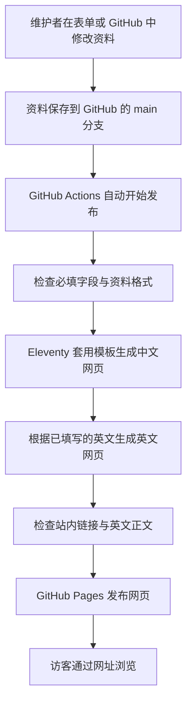

# MALab 多媒体安全实验室网站

武汉大学国家网络安全学院 · 多媒体安全与信息隐藏

这份说明写给日常更新资料的同学，以及下一位接手网站的维护者。**更新论文和老师介绍，可以使用网页表单；调整页面布局，需要修改代码。** 不必为了季度更新重新制作网站。

## 常用入口

| 我要做什么 | 点这里 |
|---|---|
| 看正式网站，或把网址发给别人 | [中文官网](https://secrethhh.github.io/lab-website/) · [English](https://secrethhh.github.io/lab-website/en/) |
| 更新论文和老师介绍 | [Pages CMS 编辑入口](https://app.pagescms.org) |
| 查看网站文件和修改历史 | [GitHub 项目](https://github.com/Secrethhh/lab-website) |
| 查看修改有没有发布成功 | [自动发布记录 Actions](https://github.com/Secrethhh/lab-website/actions) |

访客直接打开官网即可，无需 GitHub 账号。维护者才需要登录。README 是维护说明，不是网站首页。

## 阅读路线

- [网站好维护吗？](#网站好维护吗)
- [网站的运行原理](#网站的运行原理)
- [为什么不买域名也能联网？](#为什么不买域名也能联网)
- [第一次使用在线编辑](#第一次使用在线编辑)
- [日常更新操作](#日常更新操作)
- [保存后如何确认成功](#保存后如何确认成功)
- [遇到问题怎么办](#遇到问题怎么办)
- [季度更新与人员交接](#季度更新与人员交接)
- [文件位置与开发说明](#文件位置与开发说明)

## 网站好维护吗？

**适合以成果展示为主、每季度更新的实验室。** 日常资料和页面模板分开保存，一篇论文只维护一份记录，多个栏目自动使用它。

| 修改任务 | 目前怎么操作 | 难度 |
|---|---|---|
| 新增论文、改简介、改发表状态 | 在线编辑“论文与成果” | 填表即可 |
| 增加代码或数据集链接 | 编辑对应论文，补齐资源说明 | 填表即可 |
| 把论文放到首页重点展示 | 勾选“首页重点展示” | 一个开关 |
| 修改任延珍老师的个人介绍 | 在线编辑“任延珍老师个人介绍” | 填表即可 |
| 更换老师照片 | 在 GitHub 替换图片文件 | 需要文件操作 |
| 修改团队介绍、方向、网站更新日期 | 修改资料文件，并核对英文 | 需要了解文件结构 |
| 调整配色、排版、导航或新增栏目 | 修改模板和样式 | 需要前端基础 |

**目前还不是所有栏目都能可视化编辑。** 已配置的表单覆盖论文成果和老师介绍；英文需要维护者填写、审核，不会在保存时自动翻译。首次接手建议先完成一次小修改，熟悉整个流程。

无需自行运行数据库或常驻服务器，但仍需定期检查外部链接、账号权限及构建依赖。现有网站没有访客登录、评论或投稿等动态功能。

## 网站的运行原理



| 名称 | 在本网站中的作用 |
|---|---|
| GitHub 仓库 | 网上保存网站代码和资料的项目文件夹，记录每次修改 |
| `main` 分支 | 正式发布使用的那一份文件；保存到这里会触发更新 |
| Pages CMS | 在线编辑表单；把你填写的内容写回 GitHub |
| Eleventy | 根据资料和页面模板生成网页的工具 |
| GitHub Actions | 自动完成检查、生成和发布的程序 |
| GitHub Pages | 存放最终网页、供公众访问的托管服务 |

最终网页是静态文件，但内容由资料和模板自动生成。例如：同一篇论文可以同时出现在成果列表、研究方向页面、首页重点成果和开放资源页面，日常更新不需要手动修改这些网页。

中英文共用作者、年份和资源链接；分别维护标题、简介与正文。访客点击右上角的语言按钮，进入同一页面的另一语言版本。

## 为什么不买域名也能联网？

目前使用的地址是：

```text
https://secrethhh.github.io/lab-website/
        └───────┬────────┘ └─────┬─────┘
         GitHub 提供的域名       项目路径
```

这里已经有域名：`secrethhh.github.io`。GitHub 提供这个地址，并负责把它指向托管网站的服务器，所以不需要再购买一个独立域名。网页托管在 GitHub 的基础设施上，关掉你自己的电脑也不会影响访问。

域名是地址，托管服务负责提供网页，两者是不同的事情。GitHub Pages 对符合条件的公开仓库提供免费托管及默认地址；独立域名是可选项。[GitHub 官方说明](https://docs.github.com/en/pages/getting-started-with-github-pages/what-is-github-pages)

| 选择 | 是否额外购买域名 | 适合什么时候 |
|---|---|---|
| 继续使用当前 github.io 地址 | 不需要 | 现在就能展示和分享 |
| 申请学校提供的子域名 | 依学校安排 | 需要统一学校身份时 |
| 购买独立域名并绑定 | 需要按域名商报价续费 | 团队确定长期品牌和管理账号后 |

购买域名不会自动改变托管位置，也不能单独保证访问速度。免费网站仍受服务规则和网络可达性影响。网址能打开与被百度、Google 搜索收录是两回事；当前分享直接链接最明确。

## 第一次使用在线编辑

网站已上线，**不必重新创建仓库或再次设置 Pages**。

1. 打开 [Pages CMS](https://app.pagescms.org)，选择使用 GitHub 登录。
2. 使用 `Secrethhh` 账号，或已经获得本项目编辑权限的账号。
3. 按页面提示安装或授权 Pages CMS 的 GitHub App，只授权 `lab-website` 即可。
4. 打开 `Secrethhh/lab-website`，选择 `main` 分支。
5. 在编辑栏目中选择“论文与成果”或“任延珍老师个人介绍”。

表单配置已放在项目中的 `.pages.yml` 文件里，无需你重新编写。账号首次授权必须由账号使用者完成；“配置已准备好”不代表你的账号已经授权。[Pages CMS 官方接入步骤](https://pagescms.org/docs/quick-start/)

如果暂时不用 Pages CMS，也能直接在 GitHub 编辑，方法见后文。

## 日常更新操作

### 1. 新增或修改一篇论文

在“论文与成果”中新增记录，或打开已有记录。

| 字段 | 怎么填 |
|---|---|
| 成果标题、英文标题 | 中文展示标题及对应英文，英文可采用论文原题 |
| 年份 | 四位数字，例如 `2026` |
| 研究方向 | 从多媒体安全、信息隐藏中选择 |
| 作者列表、会议或期刊 | 按正式发表信息填写 |
| 发表状态 | 如“已发表”“已录用”“预印本”；在审不要写成录用 |
| 简介、英文简介 | 简短介绍问题和贡献，用于列表展示 |
| 论文链接 | 使用 `https://` 开头的真实原文地址；没有就留空 |
| 首页重点展示 | 开启后进入首页重点成果，建议控制数量 |
| 草稿 | 开启时不显示在官网；确认内容后关闭，才会发布 |

没有代码、数据集链接的论文，继续填写“详细介绍”和“英文详细介绍”。详细介绍可以使用小标题和段落；不要只重复论文标题。

**保存会触发自动发布。** 首次试用可以先修改一篇已有论文的一小段文字，确认成功后再批量更新。

### 2. 给论文添加开放资源

仍然编辑同一篇论文，无需另外创建资源页面。

填写代码或数据集链接后，需要补齐以下中英文说明：

| 字段 | 要回答的问题 | 写法示例 |
|---|---|---|
| 资源简称 | 这个项目叫什么？ | `RTCFake` |
| 研究问题 | 原有方法在什么场景遇到困难？ | 真实通话中的传输处理会影响检测 |
| 核心方法 | 论文采用什么主要思路？ | 配对语音与一致性学习 |
| 开放内容 | 实际可以获得什么？ | 数据集、实验代码或模型，按实际填写 |
| 适用场景 | 别人能用它研究什么？ | 跨平台伪造检测与鲁棒性评估 |

这些内容会同时用于资源页和该论文的详情页。填写了“研究问题”等结构化说明的论文，详情页优先展示这些说明，而不是下方的自由正文。

不要把未开放的代码写成已开放；大型数据集使用外部项目链接，不需要上传到网站仓库。

### 3. 修改任延珍老师的个人介绍

进入“任延珍老师个人介绍”，按栏目编辑：

- 职称、导师资格与邮箱。
- 个人简介、研究领域、教育背景、工作访学、教学和学术服务。
- 每条中文内容及其对应英文。
- 资料核对日期。

现有栏目中的英文标识用于页面内跳转，日常改文字时保留它即可。时间段优先使用数字；如果新增“至今”等中文时间表达，要同步检查英文页面。

更换照片时替换 `src/assets/ren-yanzhen.jpg`，保持文件名不变。个人页中列出的“代表性研究”目前由页面模板选定，修改这组选列论文需要编辑 `src/people/ren-yanzhen.njk`。

### 4. 不用表单，直接在 GitHub 修改

1. 打开 [论文资料文件夹](https://github.com/Secrethhh/lab-website/tree/main/src/publications)。
2. 点击要修改的 `.md` 文件，再点击铅笔图标。
3. 修改内容，保留上方 `---` 之间的字段格式。
4. 点击 **Commit changes**（提交修改），填写简短说明，例如“更新 RTCFake 简介”，保存到 `main`。
5. 查看自动发布记录，成功后检查官网。

新增文件时可参考已有论文，使用不重复的简短文件名。已发布文件不要随意重命名，因为文件名会影响论文详情页地址。

## 保存后如何确认成功

1. 打开 [Actions 发布记录](https://github.com/Secrethhh/lab-website/actions)。
2. 找到与你刚才修改对应的最新一次 **Publish website**。
3. 等待它完成：黄色表示处理中，绿色对勾表示成功，红色表示失败。一次发布通常需要几分钟，具体以运行结果为准。
4. 打开官网，检查中文和英文页面，以及论文、代码、数据集链接。
5. 如果还看到旧版，使用 `Ctrl + F5` 强制刷新，或用无痕窗口检查。

自动检查能发现部分必填内容缺失、错误年份、站内链接问题和未翻译的英文正文。它不会代替人工核实作者、发表状态、研究结论，也不会保证外部资源链接长期有效。

## 遇到问题怎么办

| 现象 | 优先检查 |
|---|---|
| 新论文没有显示 | 是否保存到了 `main`、是否仍为草稿、最新发布是否成功 |
| 没出现在首页 | 是否开启“首页重点展示” |
| 没出现在开放资源 | 是否填写代码或数据集链接；只有论文原文链接不会进入资源列表 |
| 提示缺少英文内容 | 补齐对应英文字段；无资源论文需填写英文详细介绍 |
| 提示资源说明未填完整 | 补齐资源简称和四项中英文说明 |
| 团队介绍修改后英文检查失败 | 公共介绍的中文和 `translations.json` 内对应译文需一起更新 |
| CMS 看不到项目 | 核对 GitHub 账号、项目权限及 App 授权范围 |
| 图片没更新 | 确认替换的是 `src/assets/ren-yanzhen.jpg`，再检查发布与缓存 |
| 发布失败但旧网站仍可打开 | 修复报错后重新保存；构建失败通常不会替换已发布版本 |

查看失败原因：点开红色运行记录，再展开失败步骤，阅读最后几行错误。需要他人协助时，提供该运行记录的链接和错误信息。

改错内容可以恢复：在 GitHub 打开对应文件，进入 **History**（历史），找到修改前的版本，复制旧内容回当前文件并提交。文件仍在时这样做最直观；删除或重命名的文件需要按原路径恢复。不需要删除整个项目。

## 季度更新与人员交接

每季度按这份清单检查一次：

- [ ] 增加新成果，核实录用与发表状态。
- [ ] 补齐中英文介绍，检查代码、数据集、论文链接。
- [ ] 调整首页重点成果，确认老师信息是否需要更新。
- [ ] 修改 `src/_data/site.json` 中的 `updated` 日期。
- [ ] 确认最新自动发布成功，并用电脑和手机查看中英文页面。

交接时，把本 README、GitHub 项目和编辑入口交给下一位维护者，给对方添加项目协作者权限，不共享个人密码。请对方实际完成一次“修改 → 保存 → 发布 → 查看官网”，再完成交接。

网站目前保存在个人账号下。以后若转移到实验室 GitHub 组织，要同时检查新的官网地址、站内外引用、Pages 设置和 CMS 授权，不能只改项目名称。

仓库是公开的。**草稿开关只控制官网显示，不会隐藏 GitHub 文件和历史。** 未公开资料不要写入这里。

## 文件位置与开发说明

日常填表不需要安装以下开发工具。需要改布局或本地预览的维护者再阅读本节。

| 文件或目录 | 内容 |
|---|---|
| `src/publications/*.md` | 每篇论文的中英文资料、资源链接和说明 |
| `src/_data/faculty.json` | 老师个人介绍的中英文内容 |
| `src/_data/site.json` | 实验室简介、方向信息、网站更新日期 |
| `src/_data/translations.json` | 公共文字的中文与英文对应关系 |
| `src/about.njk` | 团队详细介绍页面 |
| `src/people/ren-yanzhen.njk` | 老师个人页排版与代表成果选列 |
| `src/_includes/layout.njk` | 所有页面共用的导航、页头和页尾 |
| `src/assets/academic.css` | 当前网站样式 |
| `.pages.yml` | 在线表单字段配置 |
| `.github/workflows/pages.yml` | 自动构建与发布流程 |
| `scripts/` | 资料检查、输出清理、英文生成与链接检查 |
| `_site/` | 自动生成的网页；不要直接修改 |

公共文字翻译使用中文原文作为匹配依据：修改中文公共介绍时，应一起更新对应英文。论文和教师资料的英文字段随同一条记录保存。研究方向细分介绍在 `site.json` 中使用成对的 `title/titleEn`、`description/descriptionEn` 字段。

### 本地运行

使用 Node.js 24 和 pnpm 11.19.0，在项目文件夹内执行：

```sh
npm install --global pnpm@11.19.0
pnpm install --frozen-lockfile
pnpm dev
```

打开终端给出的本地地址。发布前执行：

```sh
pnpm build
pnpm check
```

`pnpm build` 会清理并重建 `_site`，生成中英文网页。删除论文或将已发布内容改回草稿后，本地应完整构建，避免误看旧预览。`_site/index.html` 也可以双击离线查看。

不要提交 `node_modules` 或 `_site`。更改依赖时一并提交 `package.json` 与 `pnpm-lock.yaml`；定期检查依赖和 Actions 兼容性，升级后先验证再发布。

### 重新部署时才需要的设置

当前项目已经设置好。只有迁移或重建时才检查：进入项目 **Settings → Pages → Build and deployment → Source**，选择 **GitHub Actions**。再到 Actions 中运行 **Publish website**。

### 两种方案的取舍

| 方案 | 优点 | 维护成本 |
|---|---|---|
| 当前方案：Eleventy + Pages CMS + GitHub Pages | 内容与排版分离，公开资料可追溯，不必自行管理服务器 | 维护中英文资料与构建配置；特殊栏目仍需改文件 |
| WordPress + 学校服务器或商业托管 | 通用后台，可扩展更多动态功能 | 需要维护服务器或托管服务、数据库、主题插件与备份；费用按实际服务确定 |

## 内容来源

研究内容来自团队提供的成果材料和公开论文，核实范围见 [SOURCES.md](SOURCES.md)。个人介绍依据学院官网整理。参考研究团队网站的栏目组织与排版，网站代码和内容维护方式按本团队需求实现。

- [学院任延珍老师主页](https://cse.whu.edu.cn/info/3421/40341.htm)
- [版式参考：复旦 MAS](https://fdmas.github.io/index.html)
- [Eleventy 文档](https://www.11ty.dev/docs/)
- [Pages CMS 文档](https://pagescms.org/docs/)
- [GitHub Pages 文档](https://docs.github.com/en/pages)

论文、数据和外部代码的使用许可，以各原始项目说明为准。

